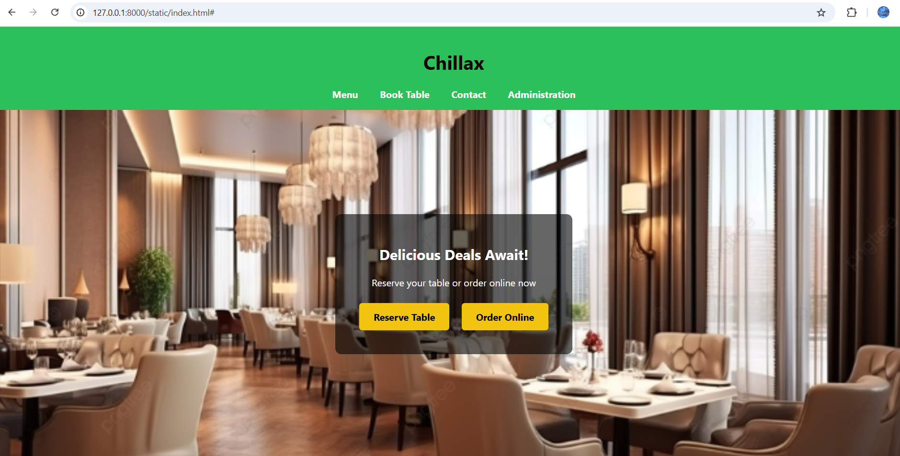
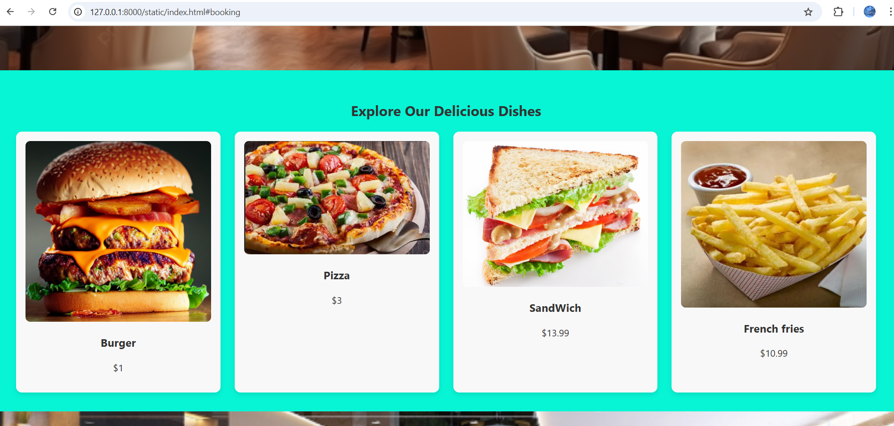
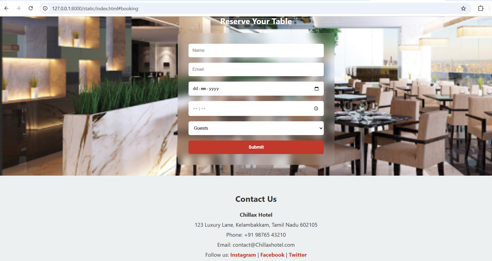

# Ex.07 Restaurant Website
## Date:1.02.2025

## AIM:
To develop a static Restaurant website to display the food items and services provided by them.

## DESIGN STEPS:

### Step 1:
Requirement collection.

### Step 2:
Creating the layout using HTML and CSS.

### Step 3:
Updating the sample content.

### Step 4:
Choose the appropriate style and color scheme.

### Step 5:
Validate the layout in various browsers.

### Step 6:
Validate the HTML code.

### Step 7:
Publish the website in the given URL.

## PROGRAM:
```
index.html
<!DOCTYPE html>
<html lang="en">
<head>
  <meta charset="UTF-8" />
  <meta name="viewport" content="width=device-width, initial-scale=1.0" />
  <!-- 🔧 Change the title to your restaurant name -->
  <title>Chillax Restaurant</title>
  <link rel="stylesheet" href="style.css" />
</head>
<body>
  <header>
    <!-- 🔧 Replace 'HOTSPOT' with your restaurant name -->
    <h1> Chillax</h1>
    <nav>
      <a href="#menu">Menu</a>
      <a href="#booking">Book Table</a>
      <a href="#contact">Contact</a>
    </nav>
  </header>

  <section class="hero">
    <!-- 🖼 Hero background image is set in CSS (see .hero in style.css) -->
    <div class="overlay">
      <h2>Delicious Deals Await!</h2>
      <p>Reserve your table or order online now</p>
      <div class="hero-buttons">
        <a href="#booking" class="btn">Reserve Table</a>
        <a href="#menu" class="btn">Order Online</a>
      </div>
    </div>
  </section>

  <section id="menu">
    <h2>Explore Our Delicious Dishes</h2>
    <div class="menu-grid">
      <!-- 🍔 Dish Card 1 -->
      <div class="dish">
        <!-- 🖼 Replace with your burger image URL or file -->
        
        <!-- 🔧 Change dish name and price -->
        <h3>Burger</h3>
        <p>$1</p>
      </div>

      <!-- 🍕 Dish Card 2 -->
      <div class="dish">
        
        <h3>Pizza</h3>
        <p>$3</p>
      </div>

      <!-- 🍝 Dish Card 3 -->
      <div class="dish">
        
        <h3>SandWich</h3>
        <p>$13.99</p>
      </div>

      <!-- 🥗 Dish Card 4 -->
      <div class="dish">
        
        <h3>French fries</h3>
        <p>$10.99</p>
      </div>
    </div>
  </section>

  <section id="booking">
    <h2>Reserve Your Table</h2>
    <!-- 🖼 Optional: Add a background image in CSS for booking section -->
    <form>
      <!-- 🧑 User name -->
      <input type="text" placeholder="Name" required />
      <!-- 📧 User email -->
      <input type="email" placeholder="Email" required />
      <!-- 📅 Reservation date -->
      <input type="date" required />
      <!-- ⏰ Reservation time -->
      <input type="time" required />
      <!-- 👥 Number of guests -->
      <select required>
        <option value="">Guests</option>
        <option>1</option>
        <option>2</option>
        <option>3</option>
        <option>4+</option>
      </select>
      <!-- ✅ Submit button -->
      <input type="submit" value="Submit" />
    </form>
  </section>

  <section id="contact">
    <h2>Contact Us</h2>
    <div class="contact-info">
    <!-- 🏨 Hotel or Restaurant Name -->
    <p><strong>Chillax Hotel</strong></p>

    <!-- 📍 Address -->
    <p>123 Luxury Lane, Kelambakkam, Tamil Nadu 602105</p>

    <!-- 📞 Phone Number -->
    <p>Phone: ‪+91 98765 43210‬</p>

    <!-- 📧 Email -->
    <p>Email: contact@Chillaxhotel.com</p>

    <!-- 🌐 Optional: Social Media -->
    <p>
      Follow us:
      <a href="#">Instagram</a> |
      <a href="#">Facebook</a> |
      <a href="#">Twitter</a>
    </p>
  </div>
</section>


  <footer>
    <!-- 🔧 Update restaurant name if changed -->
    <p>&copy; Chillax Restaurant. All rights reserved.</p>
  </footer>
</body>
</html>

style.css
/*  Global Styles */
body {
  margin: 0;
  font-family: 'Segoe UI', sans-serif;
  background: #07f5d5;
  color: #333;
}

/*  Header */
header {
  background: #2bc05a; /* 🔧 Change to your brand color */
  color: rgb(24, 5, 5);
  padding: 1rem;
  text-align: center;
}

nav a {
  margin: 0 1rem;
  color: white;
  text-decoration: none;
  font-weight: bold;
}

/*  Hero Section */
.hero {
  /* 🔧 Replace with your hero image URL */
  background: url('ht1.png') center/cover no-repeat;
  height: 80vh;
  position: relative;
  display: flex;
  align-items: center;
  justify-content: center;
}

.overlay {
  background: rgba(0, 0, 0, 0.6); /* 🔧 Adjust overlay darkness */
  padding: 2rem;
  text-align: center;
  color: white;
  border-radius: 10px;
}

/*  Hero Buttons */
.hero-buttons .btn {
  background: #f1c40f; /* 🔧 Button color */
  color: #000;
  padding: 0.75rem 1.5rem;
  margin: 0.5rem;
  text-decoration: none;
  border-radius: 5px;
  font-weight: bold;
  display: inline-block;
  transition: transform 0.3s ease;
}

.hero-buttons .btn:hover {
  transform: scale(1.05);
}

/*  Menu Section */
#menu {
  padding: 2rem;
  text-align: center;
}

.menu-grid {
  display: grid;
  grid-template-columns: repeat(auto-fit, minmax(220px, 1fr));
  gap: 1.5rem;
  margin-top: 1rem;
}

.dish {
  background: #f8f8f8;
  padding: 1rem;
  border-radius: 10px;
  box-shadow: 0 4px 8px rgba(0,0,0,0.1);
  transition: transform 0.3s ease;
}

.dish:hover {
  transform: scale(1.03);
}

.dish img {
  width: 100%;
  border-radius: 8px;
}

/*  Booking Section */
#booking {
  padding: 2rem;
  text-align: center;
  background: url('ht2.png')center/cover no-repeat; /* 🔧 Optional: add background image here */
  color: white;
}
#contact {
  padding: 2rem;
  background: #ecf0f1;
  text-align: center;
}

.contact-info p {
  margin: 0.5rem 0;
  font-size: 1rem;
}

.contact-info a {
  color: #c0392b;
  text-decoration: none;
  font-weight: bold;
}

.contact-info a:hover {
  text-decoration: underline;
}
form {
  background: rgba(255, 255, 255, 0.1); /* 🔧 Glass effect */
  backdrop-filter: blur(10px);
  padding: 2rem;
  border-radius: 10px;
  max-width: 400px;
  margin: auto;
  display: grid;
  gap: 1rem;
}

input, select {
  padding: 0.75rem;
  border-radius: 5px;
  border: none;
}

input[type="submit"] {
  background: #c0392b;
  color: white;
  font-weight: bold;
  cursor: pointer;
}

/*  Footer */
footer {
  background: #333;
  color: white;
  text-align: center;
  padding: 1rem;
}
```


## OUTPUT:





## RESULT:
The program for designing software company website using HTML and CSS is completed successfully.
